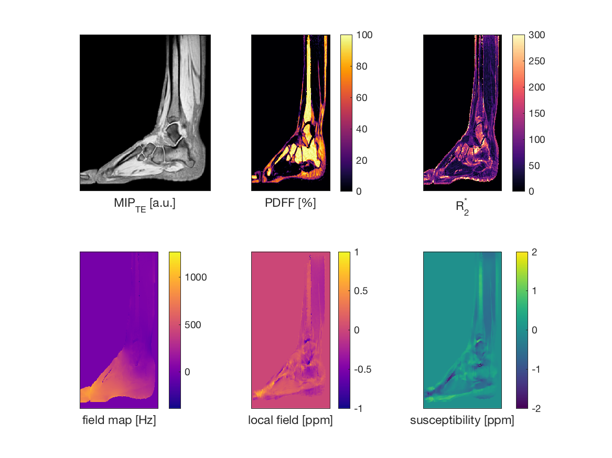

# Description

Example source code to perform Quantitative Susceptibility Mapping (QSM) to measure trabecular bone density from the article

*Diefenbach, M. N., Meineke, J., Ruschke, S., Baum, T., Gersing, A., & Karampinos, D. C., On the sensitivity of quantitative susceptibility mapping for measuring trabecular bone density, Magnetic Resonance in Medicine, (),  (2018).*  <http://dx.doi.org/10.1002/mrm.27531>

    @article{diefenbach18_sensit_quant_suscep_mappin_measur,
      author =       {Maximilian N. Diefenbach and Jakob Meineke and
                      Stefan Ruschke and Thomas Baum and Alexandra Gersing
                      and Dimitrios C. Karampinos},
      title =        {On the Sensitivity of Quantitative Susceptibility
                      Mapping for Measuring Trabecular Bone Density},
      journal =      {Magnetic Resonance in Medicine},
      year =         2018,
      doi =          {10.1002/mrm.27531},
      url =          {https://doi.org/10.1002/mrm.27531},
    }

# Repository Overview

-   `scripts/`: batch processing functionality
    -   `demo.m`: runs QSM method from the paper on example dataset
    -   `WFI_subject.m`: function to run field mapping step on a single subject dataset
    -   `BFR_subject.m`: function to run background field removal step on a single subject dataset
    -   `QSM_subject.m`: function to run dipole inversion step on a single subject dataset
    -   &#x2026;
-   `code/`: core algorithms
    -   `3rd`: third party libraries
    -   &#x2026;
-   `data/`: includes data of one examplary subject
    -   `20180406_502_CT.nrrd`: CT image
    -   `20180406_144018_0302_bFFEhires.nii.gz`: high res bSSFP image
    -   `20180406_144018_0302_ImDataParams.mat:` TIMGRE data
-   `figures/`: LaTeX/TikZ code to reproduce figures from the paper

# Example Result

Output from the script `demo.m`:

# License

MIT License

Copyright (c) 2018 Maximilian N. Diefenbach

Permission is hereby granted, free of charge, to any person obtaining a copy
of this software and associated documentation files (the "Software"), to deal
in the Software without restriction, including without limitation the rights
to use, copy, modify, merge, publish, distribute, sublicense, and/or sell
copies of the Software, and to permit persons to whom the Software is
furnished to do so, subject to the following conditions:

The above copyright notice and this permission notice shall be included in all
copies or substantial portions of the Software.

THE SOFTWARE IS PROVIDED "AS IS", WITHOUT WARRANTY OF ANY KIND, EXPRESS OR
IMPLIED, INCLUDING BUT NOT LIMITED TO THE WARRANTIES OF MERCHANTABILITY,
FITNESS FOR A PARTICULAR PURPOSE AND NONINFRINGEMENT. IN NO EVENT SHALL THE
AUTHORS OR COPYRIGHT HOLDERS BE LIABLE FOR ANY CLAIM, DAMAGES OR OTHER
LIABILITY, WHETHER IN AN ACTION OF CONTRACT, TORT OR OTHERWISE, ARISING FROM,
OUT OF OR IN CONNECTION WITH THE SOFTWARE OR THE USE OR OTHER DEALINGS IN THE
SOFTWARE.
